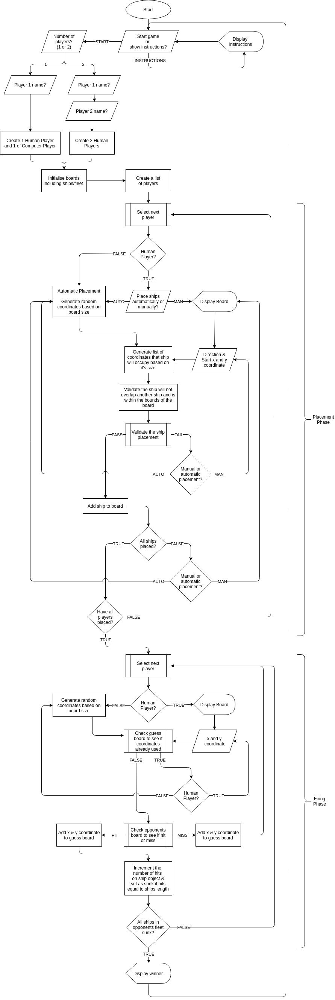

# Battleships

Battleships is a version of the classic game of the same name. This
implementation allows for either a 1 player (human vs computer) match or for 2
players to go head to head via pass and play.

Players can choose to play on 2 sizes of board, small (5x5) or large (9x9). The
size of the board will alter the size of the fleet (number of ships) they
each have.

Players can choose to place ships manually or have this done for them, before
starting the firing phase of the game. Useful information is displayed about the
ships remaining in the player's fleet and the number of opponent ships
remaining. The left board displays the current player's ship placements and
their opposition's guesses, and on the right board their own guess history is
displayed.

The winner is the first to sink all of their opponent's ships!

The site was designed to showcase skills acquired during the learning portion of
the Code Institute Python module.

## Demo

[View the live project here.](https://ci-pp3-battleships.herokuapp.com/)

## Table of contents

- [User Experience (UX)](#user-experience--ux-)
  - [User stories](#user-stories)
    - [First Time Visitor Goals](#first-time-visitor-goals)
    - [Returning Visitor Goals](#returning-visitor-goals)
- [Project aims](#project-aims)
- [Planning](#planning)
- [Features](#features)
  - [Future Development](#future-development)
- [Data model](#data-model)
  - [Overview of classes](#overview-of-classes)
  - [UML Diagram](#uml-diagram)
- [Technologies Used](#technologies-used)
  - [Languages Used](#languages-used)
  - [Modules, Packages & Programs Used](#modules--packages---programs-used)
- [Testing](#testing)
  - [W3C Markup Validators](#w3c-markup-validators)
  - [PEP8 Online](#pep8-online)
  - [Further Testing](#further-testing)
    - [Testing Methodology](#testing-methodology)
    - [Chrome Lighthouse](#chrome-lighthouse)
    - [Devices Used for End-User testing](#devices-used-for-end-user-testing)
  - [Fixed Bugs](#fixed-bugs)
    - [Code Fixes](#code-fixes)
  - [Remaining Known Bugs](#remaining-known-bugs)
- [Deployment](#deployment)
  - [Forking the GitHub Repository](#forking-the-github-repository)
  - [Making a Local Clone](#making-a-local-clone)
  - [Deploying with Heroku](#deploying-with-heroku)
- [Credits](#credits)
  - [Code](#code)
  - [Inspiration](#inspiration)
  - [Acknowledgements](#acknowledgements)

*Table of contents generated with
[markdown-toc](http://ecotrust-canada.github.io/markdown-toc/)*

## User Experience (UX)

### User stories

  User stories were created to help guide the design and implementation phases
  of the project.

#### First Time Visitor Goals

- I want to understand clearly the rules of the game.
- I want to start a short game against a computer to see if I enjoy it.
- I want to be able to play the game with a friend for a greater challenge.
- I want to be given information about my ships so I don’t have to work this out
  from the board.

#### Returning Visitor Goals

- I want to play a longer version of the game.

## Project aims

- To successfully emulate the experience of playing the classic game.
- To be written using Object Oriented Programming (OOP) Principles.
- To handle all user input appropriately and execute without errors.

## Planning

I started by creating some basic prototype functions to get a feel for how I
wanted the game to flow while I was learning more about OOP.

From this work I produced the following flowchart to guide me through the
development process:



The flowchart was produced using the [Draw.io
Integration](https://marketplace.visualstudio.com/items?itemName=hediet.vscode-drawio)
VSCode extension.

## Features

1. Welcome screen and Instructions (Initial Page Load)

    - Matching user story

      - > *I want to understand clearly the rules of the game.*

    - The game welcomes you with a large title of the game to make it clear this
      is a battleships game. From here the player can display the rules of the
      game to understand what is expected of them before starting a game.

      Welcome Screen

      

      Instructions

      

1. Game setup Phase

    - Matching user stories
      - > *I want to start a game a short game against a computer to see if I
        > enjoy it.*
      - > *I want to be able to play the game with a friend for a greater
        > challenge.*
      - > *I want to play a longer version of the game.*

    - When the player selects to play the game they have to go through a short
      setup phase. Here they will be asked to specify the number of players, the
      size of the board (abstracted as small or large), and their name(s).

      A short game would be played on a small board (5x5) which has a small
      fleet (4 ships).

      If a 2 player game is specified then a screen is presented to pause play
      before the game starts and at the end of each turn whilst players swap
      seats.

      A longer game would be played on the large board (9x9) which has a large
      fleet (7 ships).

      

1. Placement Phase

    - The placement of ships can be done automatically or manually. If the
      player selects to have the ships placed automatically, the game will
      generate a random direction, and random start x and y coordinates before
      passing these variables to the same validation functions used in manual
      placement. If validation fails a new set of variables will be generated
      until the ship passes and can be placed on the board. This repeats until
      all ships in the fleet have been placed.

      Manual placement follows the same logic but the player is asked to input
      the variables and the board is presented to them. If placement is manual
      the player is told which ship is currently being placed and how many
      spaces it will occupy.

      If the player does not enter valid input they will be told why the input
      is not valid and prompted again. If they overlap a ship or place a ship
      outside the bounds of the board this will also be fed back and they will
      be prompted to begin placement of the ship again until it can be placed.
      Again this stage repeats until all ships in the fleet have been placed.

      

      [Placement Phase static image representation](assets/docs/features/features-placementphase.png)

1. Firing phase

    - Matching user stories
      - > *I want to be given information about my ships so I don’t have to work
        > this out from the board.*

    - Useful information is displayed about the ships remaining in the players
      fleet and the number of opponent ships remaining. The left board displays
      the current players ship placements, with each ship represented by its
      symbol (which is set to its initial character) and oppositions guesses in
      the form of X’s for Hits and O’s for Misses. On the right board the
      current players own guess history is shown in the same X and O format.

      The firing phase will prompt a human player for coordinates or generate
      them randomly if it is the computer players turn. The coordinates are then
      checked against the guess board list to see if they have been previously
      used and prompt for or generate new coordinates if they are not original.

      The value of the position on the opponent's play board list is checked. If
      the index position contains an instance of a ship class, the object
      variable used to track hits for that object is incremented. The ship
      object is then checked to see if the number of times it has been hit is
      equal to its length. If this is true then the user is notified that they
      have ‘Sunk’ the target, otherwise the message will state they have ‘Hit’ a
      ship.

      If the list position is None (empty) then a miss is reported.

      The results are added to each board (the opponent's play board to show
      where they guessed, and their own guess board).

      The status of the opponent's fleet is then checked to see if any ships are
      still afloat. If there are no ships remaining the game over screen is
      displayed. Otherwise play is passed to the next player.

      

      [Firing Phase static image representation](assets/docs/features/features-firingphase.png)

1. Pass and play during 2 player game

    - Matching user stories
      - > *I want to be able to play the game with a friend for a greater
        > challenge.*

    - If a 2 player game is specified then a screen to pause play before the
      game starts, and at the end of each turn is presented whilst players swap
      seats.

      

1. Game over

    - The winner is announced and they are asked if they would like to play
      again or clarify the rules.

      Human Controlled Player Wins

      

      Computer Controlled Player Wins

      

### Future Development

- Advanced Computer Player

  I had planned to include a more advanced computer player and had begun
  investigation into how to improve guesses beyond random input by using methods
  found in the video linked below:

  [The Battleship Algorithm](https://www.youtube.com/watch?v=LbALFZoRrw8)

  I would have particularly focused on 2 strategies mentioned in the video:

  - Parity - Only target alternating spaces (visualize a checkers board) which
    reduces the number of spaces to guess in by 50%.

  - Seek and Destroy - As soon as a hit is detected the surrounding tiles would
    be checked until another hit is detected. This would be repeated until the
    ship had been sunk.

  As my advanced computer player was not properly planned at the start of
  development I faced problems getting the information needed for the computer
  to make the types of decisions that would have been required for a Seek and
  Destroy strategy and ultimately ran out of time.

  I had determined how to implement parity in my guesses (prototype code below).
  However this was somewhat negated by the late addition of a ship that only
  occupied 1 space and some random input would still have been required.

  ```python
  from itertools import cycle

  test_board = [
      ["X", "0", "X", "0", "X"],
      ["0", "X", "0", "X", "0"],
      ["X", "0", "X", "0", "X"],
      ["0", "X", "0", "X", "0"],
      ["X", "0", "X", "0", "X"],
  ]

  guess_coordinates = []
  switch = cycle([True, False])
  for i in range(len(test_board)):
      current_cycle = next(switch)
      for j in range(len(test_board[i])):
          if current_cycle is False:
              if j % 2 == 0:
                  guess = [i, j]
                  guess_coordinates.append(guess)

          elif current_cycle is True:
              if j % 2 != 0:
                  guess = [i, j]
                  guess_coordinates.append(guess)

  print(guess_coordinates)
  ```

- Leaderboard
  
  Using a database or a spreadsheet, the latter was the example in the Code
  Institute sample project. This would have also required the implementation of
  a way to time the game or assign a score to certain actions.

- [colorama](https://github.com/tartley/colorama)

  I would have liked to add colour to the terminal to highlight errors and
  important information. Unfortunately I ran out of time to implement for this
  release.

## Data model

I implemented my project using Object Oriented Programming and used classes and
methods to store and manipulate data.

### Overview of classes

Each portion of the game was separated into files (or modules). This meant in
the end I have a total of 5 modules containing classes that represent the ships,
fleets, boards, players and the game.

A mixin module was created but only contains one method. This was left separate for future development purposes.

Please find below a brief overview of my modules with a UML Diagram. Please refer to each of the linked files for more information as each module has been documented using detailed docstrings.

- [Board Class](https://github.com/ianmeigh/battleships/blob/main/modules/board.py)
  - Creates a board and hold methods to manipulate the board.
- [Player Class](https://github.com/ianmeigh/battleships/blob/main/modules/player.py)
  - Each player will have their own instance of the board class. Player
    attributes will be set here, such as name and levels of play automation.
    Overwritten methods from the player base class allow each subclass of player
    to behave differently to one another.
- [Ship Class](https://github.com/ianmeigh/battleships/blob/main/modules/ships.py)
  - Contains the different types of ships and methods to set and retrieve
    information about them, such as the number of times that have been hit and
    their name/type.
- [Fleets](https://github.com/ianmeigh/battleships/blob/main/modules/fleets.py)
  - Creates a fleet of ships imported from the ships module. Each fleet has a
    different size and modules to get information about the status of the fleet.
- [Game](https://github.com/ianmeigh/battleships/blob/main/modules/game.py)
  - Contain all the logic controlling the flow of the game such as game setup
    and player turns through the different phases of the game.

### UML Diagram


## Technologies Used

### Languages Used

- [Python](https://www.python.org/)

### Modules, Packages & Programs Used

- Built-in Packages/Modules
  - [os](https://docs.python.org/3/library/os.html) - This module provides a
    portable way of using operating system dependent functionality.
  - [time](https://docs.python.org/3/library/time.html) - This module provides
    various time-related functions.
  - [random](https://docs.python.org/3/library/random.html) - Generate
    pseudo-random numbers.
  - [itertools](https://docs.python.org/3/library/itertools.html) - Functions
    creating iterators for efficient looping.
- External Python Packages
  - [Pyfiglet:](https://github.com/pwaller/pyfiglet)
    - pyfiglet is a full port of [FIGlet](http://www.figlet.org/) into pure
      python. It takes text and renders it in ASCII art fonts.
  - [pylint:](https://www.pylint.org/)
    - Pylint is a Python static code analysis tool which looks for programming
      errors, helps enforcing a coding standard, sniffs for code smells and
      offers simple refactoring suggestions.
- Programs
  - [Visual Studio Code:](https://code.visualstudio.com/)
    - Visual Studio Code was used as my code editor for this project. A full
      list of plugins used can be found later in this section.
  - [Git](https://git-scm.com/)
    - Git was used for version control, using the terminal to commit to Git and
      Push to GitHub.
  - [GitHub:](https://github.com/)
    - GitHub is used to store the projects code after being pushed from Git.
  - [Graphviz:](https://graphviz.org/)
    - Graphviz is open source graph visualization software. Used with
      `pyreverse` (packaged with `pylint`) to generate the UML diagram.
- The following modules were installed or enabled in [Visual Studio
Code](https://code.visualstudio.com/) to assist with formatting and code
linting:
  - [flake8](https://github.com/pycqa/flake8) - Code Linter
  - [black](https://github.com/psf/black) - Code Formatter
- The following [Visual Studio Code](https://code.visualstudio.com/) extensions
  were utilized in the production of this project:
  - [Rewrap](https://marketplace.visualstudio.com/items?itemName=stkb.rewrap) - Used to wrap comments.
  - [Code Spell Checker](https://marketplace.visualstudio.com/items?itemName=streetsidesoftware.code-spell-checker) - Used to spell check content and commits.
  - [indent-rainbow](https://marketplace.visualstudio.com/items?itemName=oderwat.indent-rainbow) - Makes indentation easier to read.
  - [markdownlint](https://marketplace.visualstudio.com/items?itemName=DavidAnson.vscode-markdownlint) - Markdown linting and style checking for Visual Studio Code.
  - [autoDocstring](https://marketplace.visualstudio.com/items?itemName=njpwerner.autodocstring) - Generates python docstrings automatically
  - [TODO Highlight](https://marketplace.visualstudio.com/items?itemName=wayou.vscode-todo-highlight) - highlight TODOs, FIXMEs, and any keywords, annotations.
  - [Todo Tree](https://marketplace.visualstudio.com/items?itemName=Gruntfuggly.todo-tree) - Show TODO, FIXME, etc. comment tags in a tree view

## Testing

### W3C Markup Validators

The [W3C Markup Validator](https://validator.w3.org/nu/) and [W3C CSS
Validator](https://jigsaw.w3.org/css-validator/) Services were used to validate
the project to ensure there were no syntax errors or warnings.

All test passed with no errors and the results can be viewed by visiting the
linked pages below:

- [Results for index page (HTML)](https://validator.w3.org/nu/?doc=https%3A%2F%2Fci-pp3-battleships.herokuapp.com)
- [Results for
  CSS](https://jigsaw.w3.org/css-validator/validator?uri=https%3A%2F%2Fvalidator.w3.org%2Fnu%2F%3Fdoc%3Dhttps%253A%252F%252Fci-pp3-battleships.herokuapp.com&profile=css3svg&usermedium=all&warning=1&vextwarning=&lang=en)

### PEP8 Online

[PEP8 online](http://pep8online.com) - PEP8 Online was used in conjunction with
a code linter and formatter in my IDE to ensure the [PEP 8](https://pep8.org/)
style guidelines were adhered to.

No problems were present in my final Python code.


### Further Testing

#### Testing Methodology

To test the application throughout it's development, regular full play sessions
of the game took place. Debug code was created at the base of each class at
early stages to create an instance and simulate use. Extensive use of print
statements was made to view method output and small debug functions were
produced, such as one created to view the board list’s contents (commit
17e7836).

Testing took place throughout the project through continued play and refinement.
I used the print statement to view method output and production of small debug
functions, such as one created to view the board list’s contents (commit
17e7836).

Once the computer player was automated I could test more easily by having 2
computer players run through the game quickly from start to finish by commenting
out any calls to the `sleep` method of the built-in `time`.

At the end of development the complete testing procedure followed the
methodology listed below:

- Each time a game is started the following items will be checked:
  1. Test input using uppercase and lowercase input.
  1. Test using empty input & single space.
  1. Enter name < 3 chars long & empty string.
  1. Test using input outside the range requested and of opposite type (int <-->
    string, etc.).
  1. Place overlapping ships.
  1. Place ship so that its length extends beyond the board size (out of
    bounds).
  1. Fire on previous used coordinate
  1. Check coordinates selected to fire upon are reported accurately on the
    guess board.
  1. Ensure the accuracy of the displayed fleet information, comparing it to
    what is reported on the boards.

#### Chrome Lighthouse

Tested using the Chrome Lighthouse tools.

- Desktop

  

#### Devices Used for End-User testing

Tested using Firefox, Chrome and Web (GNOME WebKitGTK browser).

### Fixed Bugs

Throughout the project a number of issues were identified from continual
testing:

#### Code Fixes

- Correct counter of ships to be placed - [Link to
  Commit](https://github.com/ianmeigh/battleships/commit/f95cc1a716e5ef5bd196377e12278ce0fba697c8)

  Decrement the variable containing the number of ships left to place. Number
  was previously not being decremented.

- Fix input string conversion to lowercase - [Link to
  Commit](https://github.com/ianmeigh/battleships/commit/0c1c6ed7c372ed837084cef1a9f8d7241fd0b4f1)

  Input strings were not being converted to lowercase before being returned.

- Correct index order when referencing 2D list - [Link to
  Commit](https://github.com/ianmeigh/battleships/commit/30ec3ea92ec9874d8c2639ea3e265e034a58a20c)

  In order to reference the correct position in the 2D list (when displayed as a
  board/grid) the x and y coordinates need to be swapped. This is due to the
  first index position specified (`list[i]`) representing the y coordinate (or
  the row) and the second index position (`list[i][j]`) representing the x
  coordinate (or the column). This was missed in the initial testing but is
  corrected by this commit.

- Correct order of parameters passed to validate_position - [Link to
  Commit](https://github.com/ianmeigh/battleships/commit/17e78369de10351e3b74c2406b593f7568ab8d4b)

  The guess board was being checked incorrectly as the x and y coordinates need
  to be swapped in the method call. See [commit
  30ec3ea](https://github.com/ianmeigh/battleships/commit/30ec3ea92ec9874d8c2639ea3e265e034a58a20c)
  above for explanation of a similar issue.

- Fix input validation - [Link to
  Commit](https://github.com/ianmeigh/battleships/commit/22814cdc94900b6ef9f83045ae7c0f99707c7f30)

  Wasn't using an `if.. elif` statement so player input was not being validated
  correctly and undesirable input was being accepted.

- Input validation requires user input in lowercase - [Link to
  Commit](https://github.com/ianmeigh/battleships/commit/693cce0a63c252581150f62483f7881825e7dccc)

  Input strings were not being converted to lowercase before being used in `if`
  statements.
  
- Remove validation check in fire_missile function - [Link to
  Commit](https://github.com/ianmeigh/battleships/commit/f0cb88df8d33cfba9af2b35e2d4ba7a540bd7c8b)

  The fire_missile function contained an unnecessary call to the
  check_valid_position function leftover from earlier development.

  When the code to add guesses to the opponent's play board was introduced
  ([commit
  009a4b8](https://github.com/ianmeigh/battleships/commit/009a4b82f7450d19578e89bcd0dabc0a2e0455a8)),
  this validation check produced errors as it did not contain logic to handle
  the new strings "Hit" and "Miss" added to the the play_board list, therefore
  the check returned False.

  A string would then be checked to see if it was `in` the returned value
  raising a TypeError as a bool is not iterable.
  
- Update print statements to fit terminal width constraints - [Link to
  Commit](https://github.com/ianmeigh/battleships/commit/923a1ec6e0b862260329ec5c3d72f0982598b9a3)

  Once deployed to Heroku there were problems displaying the larger board due to
  a miscalculation during planning. This fix reduced board spacing.

- Change to accept upper and lowercase input - [Link to
  Commit](https://github.com/ianmeigh/battleships/commit/544d36d4fece2da66e87275af66d0339aed9e952)

  The coin toss function used to determine play order was made to accept upper
  and lowercase input as suggested via CI Slack user feedback. This made it
  consistent with other sections of the game.

- Ensure player name cannot be empty - [Link to
  Commit](https://github.com/ianmeigh/battleships/commit/03eb88a2e3ed5438d6418960bb0c19a28fa7041f)

  Updated the code to ensure that the player name could not be an empty string
  as detected during testing (see [Testing Methodology](#testing-methodology)
  section).

- Update validation to detect empty input - [Link to
  Commit](https://github.com/ianmeigh/battleships/commit/f3afa63d44815e60959a93555b3cc1d99d928e8a)

  Updated the code to ensure that the coin toss guess could not be an empty
  string as detected during testing (see [Testing
  Methodology](#testing-methodology) section).

- Add code to resolve move from 2 players to 1 - [Link to
  Commit](https://github.com/ianmeigh/battleships/commit/efa8c48cf414cb4ad433410a94e1d61e69b9c899)

  If a new game 1 player game was started after a 2 player game had been
  completed, the variable to enable the pass and play pause screens was not
  being reset to False.

### Remaining Known Bugs

None

## Deployment

### Forking the GitHub Repository

By forking the GitHub Repository we make a copy of the original repository on
our GitHub account to view and/or make changes without affecting the original
repository by using the following steps...

1. Log in to GitHub and locate the [GitHub
   Repository](https://github.com/ianmeigh/category-quiz)
1. At the top of the Repository (not top of page) just above the "Settings"
   Button on the menu, locate the "Fork" Button.
1. Click the button (not the number to the right) and you should now have a copy
   of the original repository in your GitHub account.

### Making a Local Clone

1. Log in to GitHub and locate the [GitHub Repository](https://github.com/ianmeigh/category-quiz).
1. Under the repository name, click "Code".
1. To clone the repository using HTTPS, under "HTTPS", copy the link.
1. Open your local terminal with git installed
1. Change the current working directory to the location where you want the
   cloned directory to be created.
1. Type `git clone`, and then paste the URL you copied in Step 3.

    ```console
    $ git clone https://github.com/ianmeigh/category-quiz.git
    ```

1. Press Enter. Your local clone will be created.

    ```console
    $ git clone https://github.com/ianmeigh/category-quiz.git
    > Cloning into `test-dir`...
    > remote: Counting objects: 10, done.
    > remote: Compressing objects: 100% (8/8), done.
    > remove: Total 10 (delta 1), reused 10 (delta 1)
    > Unpacking objects: 100% (10/10), done.
    ```

[Click
here](https://help.github.com/en/github/creating-cloning-and-archiving-repositories/cloning-a-repository#cloning-a-repository-to-github-desktop)
to retrieve pictures for some of the buttons and more detailed explanations of
the above process.

### Deploying with Heroku

The project was deployed to Heroku using the following steps...

1. Log in to [Heroku](https://www.heroku.com/) and if not taken there
   automatically, navigate to your personal app dashboard.
1. At the top of the page locate the 'New' drop down, click it and then select
   'Create new app'.
1. Give your application a unique name, select a region appropriate to your
   location and click the 'Create app' button.
1. Your app should now be created so from the menu towards the top of the page
   click 'Settings'
1. Click 'Reveal Config Vars' in the Config vars section and enter the key as
   `PORT` and the value as `8000`. Click the Add button.
1. Under the 'Buildpacks' section click 'Add buildpack'.
    1. Select 'Python' and then click the 'Save changes' button.
    1. Click 'Add buildpack' again, select 'nodejs' and click the 'Save changes'
       button again.
    1. Ensure the build packs are ordered as below:
        1. `heroku/python`
        2. `heroku/nodejs`
1. Navigate to the 'Deploy' page using the menu towards the top of the page.
1. Select 'GitHub' from the 'Deployment method' section and you will be prompted
   to 'Connect to GitHub'.
1. Once connected to your GitHub account you will be able to search for your
   repository which contains the battleships code.
1. Once the repository is found click 'Connect'.
1. At the bottom of the page find the section named 'Manual deploy', select the
   'main' branch in the drop down and click the 'Deploy' button.
1. Once deployment is complete, click the 'View' button to load the URL of the
   deployed application.

## Credits

### Code

- [Code Institute Sample
  README](https://github.com/Code-Institute-Solutions/SampleREADME)
  - Elements of the README were copied and adapted from the Code Institute
    sample readme.
- [Pythondex](https://pythondex.com/python-battleship-game)
  - Code to use characters as the label of the y axis
- [PyQuestions.com](https://pyquestions.com/clear-terminal-in-python)
  - Code to clear terminal

### Inspiration

- I was inspired by David Bowers' (a fellow CI student) project where he uses 2
  boards per player (1 to hold ships and 1 to hold guesses) and displays them
  side by side during the game.
  - Project URL -
    [https://github.com/dnlbowers/battleships](https://github.com/dnlbowers/battleships)

### Acknowledgements

- The Code Institute Slack community for support during this project.
